# Tiki Price & Promotion Intelligence

An end-to-end data engineering project for collecting, processing, storing, transforming, and analyzing Tiki product data.

The current pipeline extracts product data from the Tiki listing API, stores raw and cleaned data in MinIO, loads daily snapshots into BigQuery, transforms the data with dbt, and orchestrates the workflow with Apache Airflow.

The project focuses on tracking **product prices, promotions, product attributes, sellers, and their changes over time**.

---

## Table of Contents

1. [Business Problem](#business-problem)
2. [Architecture](#architecture)
3. [Data Pipeline](#data-pipeline)
4. [Data Model](#data-model)
5. [Data Quality](#data-quality)
6. [Analytics](#analytics)
7. [How to Run](#how-to-run)
8. [Project Structure](#project-structure)
9. [Future Improvements](#future-improvements)

## Business Problem

E-commerce product information changes frequently. Prices, promotions, ratings, reviews, availability, and product attributes can change over time.

A single daily snapshot is not enough to analyze these changes. The pipeline therefore needs to:

- collect product data on a daily basis
- preserve historical versions of product attributes
- track daily product metrics such as price, rating, reviews, and quantity sold
- identify price changes and promotions
- analyze product and seller metrics
- provide structured data for analytical use

## Architecture

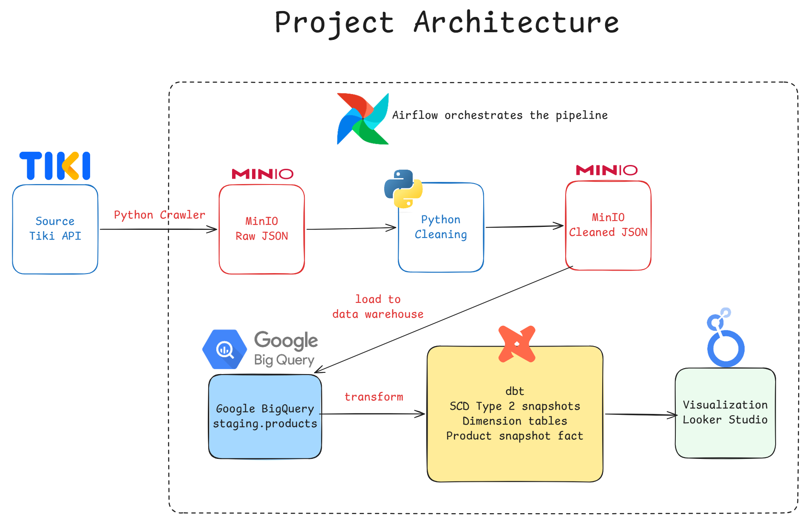

## Data Pipeline

| Stage          | Technology      | Responsibility                                        |
| -------------- | --------------- | ----------------------------------------------------- |
| Extract        | Python          | Crawl product data from the Tiki listing API          |
| Raw storage    | MinIO           | Store original API responses                          |
| Cleaning       | Python / pandas | Select fields, validate, deduplicate, normalize       |
| Warehouse      | BigQuery        | Store daily product snapshots                         |
| Transformation | dbt             | Staging, SCD2 snapshots, dimensions, facts, and tests |
| Orchestration  | Apache Airflow  | Schedule tasks, manage dependencies and retries       |
| Visualization  | Looker Studio   | Planned analytical dashboard                          |

### Airflow DAG

The main DAG is `tiki_elt_pipeline`.

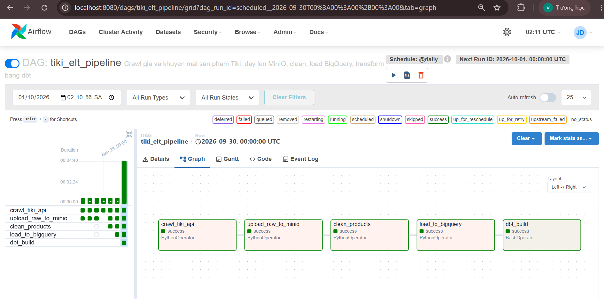

The extraction, cleaning, and loading tasks use Airflow's logical date (`ds`) to process a specific day's data.

The dbt layer normally processes the latest available snapshot. Historical backfills can be run explicitly using the `snapshot_date` dbt variable.

### Pipeline stages

#### 1. Extract

`src/extract/tiki_api_crawler.py`

- Crawls configured Tiki product categories using the listing API.
- Supports pagination and configurable crawl limits.
- Handles request failures with retry logic.
- Saves each page as raw JSON.
- Crawl parameters are maintained in `src/config/crawler_config.py`.

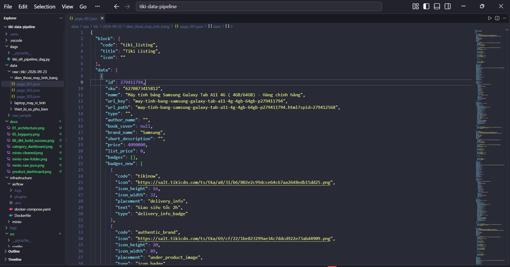

#### 2. Raw storage

`src/load/minio_uploader.py`

- Uploads raw JSON files to the `tiki-raw` bucket.
- Raw objects follow the structure:

```text
raw/tiki/{date}/{category}/page_XXX.json
```

- Raw data is kept unchanged so downstream processing can be re-run from the original source data.

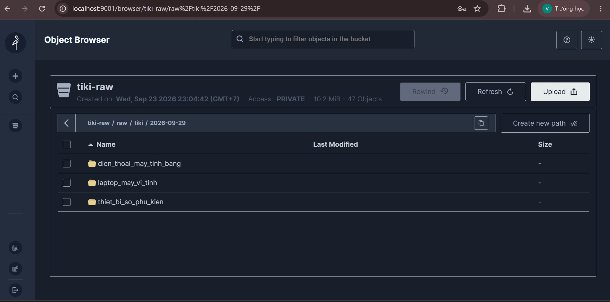

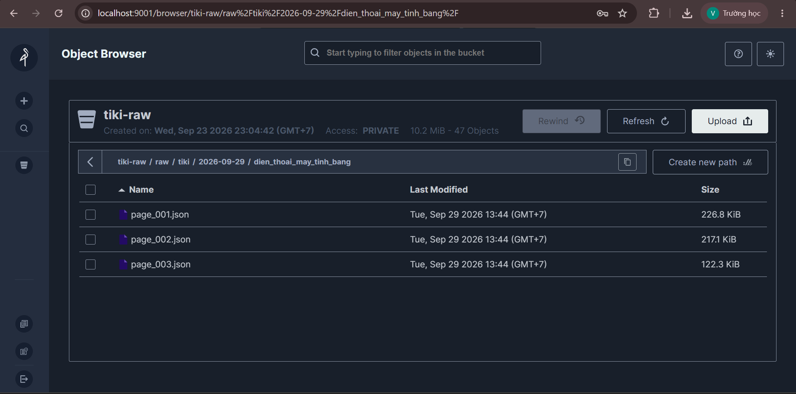

#### 3. Cleaning

`src/transform/clean_products.py`

- Reads raw JSON from MinIO.
- Keeps fields required by downstream models.
- Normalizes nested fields.
- Drops records missing required fields such as `id`, `price`, or `seller_id`.
- Drops records where `price <= 0`.
- Deduplicates products by `id`.
- Adds `snapshot_date`.
- Logs input, dropped, and output row counts.
- Writes cleaned JSONL back to MinIO:

```text
cleaned/tiki/{date}/products.jsonl
```

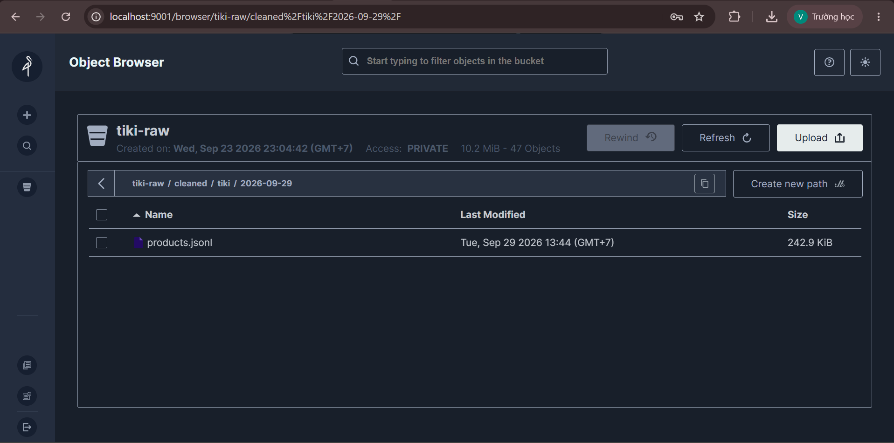

#### 4. Load

`src/load/bigquery_loader.py`

- Loads cleaned JSONL into `staging.products`.
- Uses an explicit BigQuery schema.
- The table is partitioned by `snapshot_date`.
- A run overwrites only the partition belonging to that run date, allowing a day to be reprocessed without replacing other dates.

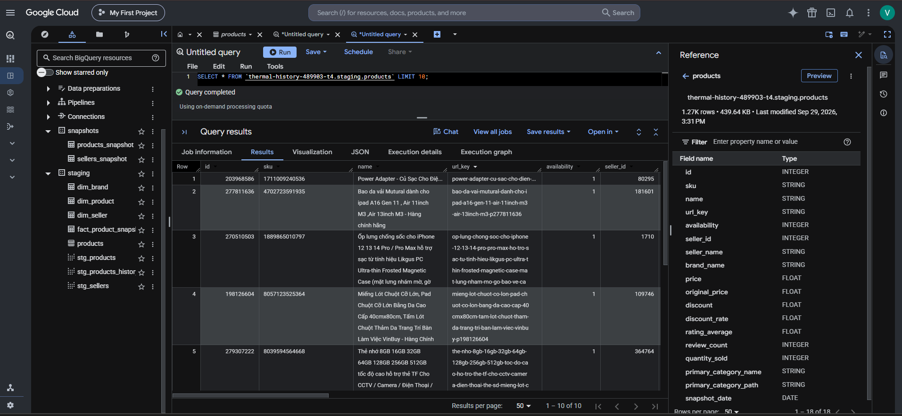

#### 5. Transform

`dbt build`

Runs dbt models, snapshots, and tests while resolving dependencies through `ref()`.

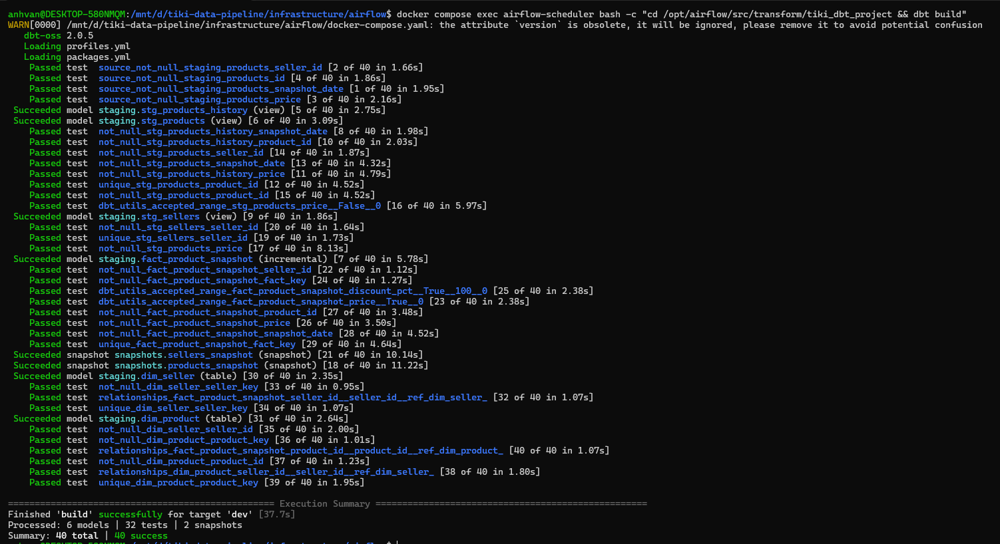

## Data Model

The current transformation layer contains staging models, SCD2 snapshots, dimensions, and a daily fact table.

```text
                  dim_product
                       │
                       ▼
dim_seller ───── fact_product_snapshot
```

| Model                   | Type              | Grain                          | Purpose                                                  |
| ----------------------- | ----------------- | ------------------------------ | -------------------------------------------------------- |
| `stg_products`          | View              | 1 row / product / selected day | Latest available batch, deduplicated; feeds product SCD2 |
| `stg_products_history`  | View              | 1 row / product / day          | Full history; feeds daily fact                           |
| `stg_sellers`           | View              | 1 row / seller                 | Seller list derived from product history                 |
| `products_snapshot`     | dbt snapshot      | 1 row / product version        | Historical product attributes                            |
| `sellers_snapshot`      | dbt snapshot      | 1 row / seller version         | Historical seller names                                  |
| `dim_product`           | Table             | 1 row / product version        | Product descriptive attributes                           |
| `dim_seller`            | Table             | 1 row / seller version         | Seller descriptive attributes                            |
| `fact_product_snapshot` | Incremental table | 1 row / product / day          | Daily product metrics                                    |

### SCD Type 2 — Product and Seller History

`products_snapshot` and `sellers_snapshot` preserve historical versions of slowly changing attributes.

Tracked product attributes include:

- SKU
- product name
- URL key
- seller
- brand
- category name
- category path
- dbt valid from
- dbt valid to

Illustrative example:

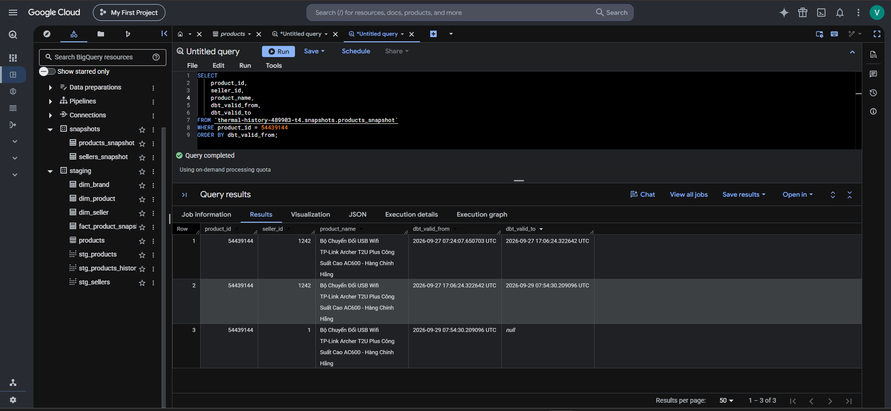

### Daily Fact — `fact_product_snapshot`

The fact table stores daily observations rather than slowly changing descriptive attributes.

Derived metrics currently include:

- `discount_pct`
- `is_promotion`
- `price_change_pct`
- `days_since_last_price_change`

`seller_id` in the fact table comes from that day's product data rather than being resolved through the SCD2 dimension. This preserves the seller associated with the product observation for that specific day.

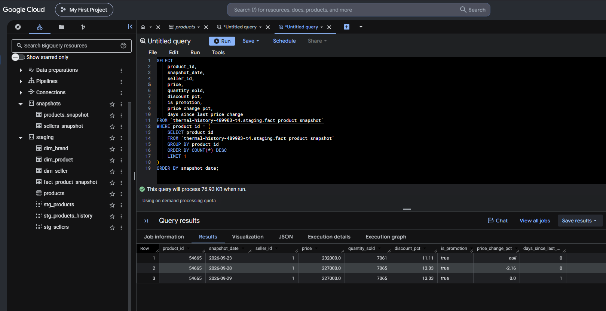

## Data Quality

The project uses dbt tests to validate:

- uniqueness of surrogate/business keys
- required fields with `not_null`
- relationships between fact and dimension tables
- valid value ranges
- schema consistency

The cleaning stage also produces a per-run data quality report containing input rows, dropped rows, and output rows.

## Analytics

The analytical layer is planned to answer questions such as:

- How do product prices change over time?
- What percentage of products are currently promoted?
- How does promotion rate vary by category?
- How does average price vary across categories?
- Which products experience frequent price changes?

### Planned analytical layer

Analytics marts will be added after the core pipeline and transformation layer are validated.

Potential marts include:

- product daily metrics
- category daily metrics

The final metrics and dashboard structure will be documented here after implementation.

### Looker Studio

A Looker Studio dashboard is planned as the visualization layer on top of the analytical BigQuery models.

[View Interactive Dashboard](https://datastudio.google.com/reporting/16005003-72d6-41fc-b24c-79dd5b5db02e)

### Product Analytics

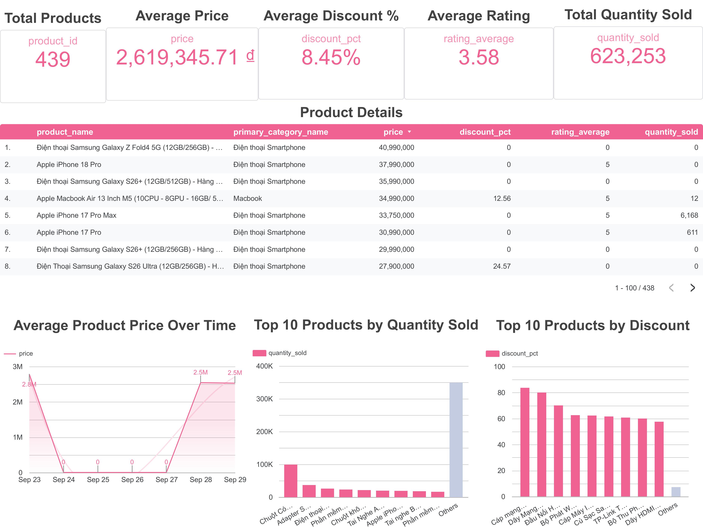

### Category Analytics

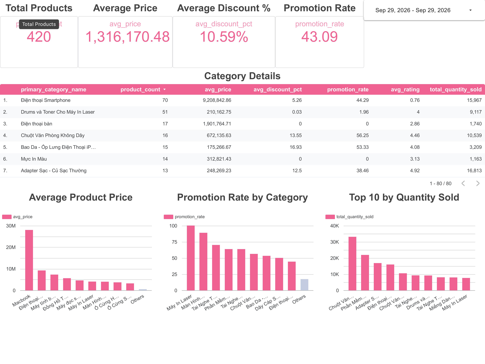

## How to Run

### Prerequisites

- Docker
- Docker Compose
- A Google Cloud project with BigQuery enabled
- Billing enabled on the Google Cloud project
- A service account with the required BigQuery permissions
- A service account JSON key

### 1. Configure environment

Create the environment file used by the Airflow Compose setup.

Example:

```env
GCP_PROJECT_ID=your-gcp-project-id
```

Place the service account key at:

```text
src/config/gcp_service_account.json
```

Do not commit the real credential file.

If a local dbt profile is required for running dbt outside the Airflow container, configure it separately according to the project's dbt profile setup.

### 2. Start the infrastructure

Create the shared Docker network if it does not already exist:

```bash
docker network create data_network
```

Start MinIO:

```bash
cd infrastructure/minio
docker compose up -d
```

Start Airflow:

```bash
cd ../airflow
docker compose up airflow-init
docker compose up -d
```

### 3. Open Airflow

Open:

```text
http://localhost:8080
```

Enable the `tiki_elt_pipeline` DAG and trigger a run.

### 4. Monitor the pipeline

The expected task sequence is:

```text
crawl_tiki_api
      ↓
upload_raw_to_minio
      ↓
clean_products
      ↓
load_to_bigquery
      ↓
dbt_build
```

### 5. Run dbt manually for development

Inside the Airflow scheduler container:

```bash
docker compose exec airflow-scheduler bash
```

Then:

```bash
cd /opt/airflow/src/transform/tiki_dbt_project
dbt build
```

---

## Project Structure

```text
.
├── dags/
│   └── tiki_elt_pipeline_dag.py
│
├── infrastructure/
│   ├── airflow/
│   │   ├── Dockerfile
│   │   └── docker-compose.yml
│   └── minio/
│       └── docker-compose.yml
│
├── src/
│   ├── config/
│   │   ├── crawler_config.py
│   │   └── gcp_service_account.json   # local only
│   │
│   ├── extract/
│   │   └── tiki_api_crawler.py
│   │
│   ├── load/
│   │   ├── minio_uploader.py
│   │   └── bigquery_loader.py
│   │
│   └── transform/
│       ├── clean_products.py
│       └── tiki_dbt_project/
│           ├── models/
│           │   └── staging/
│           │       ├── stg_products.sql
│           │       ├── stg_products_history.sql
│           │       ├── stg_sellers.sql
│           │       ├── dim_product.sql
│           │       ├── dim_seller.sql
│           │       └── fact_product_snapshot.sql
│           └── snapshots/
│               ├── products_snapshot.sql
│               └── sellers_snapshot.sql
│
├── tests/
├── requirements.txt
└── .env.example
```

> **Design principle:** Airflow is responsible for orchestration. Data extraction, cleaning, loading, and transformation logic remain in their respective application/dbt layers.

---

## Future Improvements

- Track product lifecycle events such as newly listed, removed, and out-of-stock products
- Add Slack/email alerting for failed tasks and dbt tests
- Add CI checks for dbt build and tests
- Add unit tests for crawler and loader components
